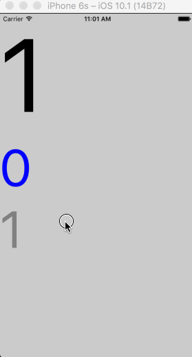

# NavigationExperimental Bug

When using `NavigationExperimental.CardStack` with `enableGestures={false}`, the first transition always ends by rendering the last card, regardless of the target.



### Expected:

1. Render a `CardStack` with two cards, 0 and 1, starting on 1
2. Trigger a transition to card 0
3. Card 0 is animated into frame
4. **After animation, card 0 is shown**

### Actual:

1. Render a `CardStack` with two cards, 0 and 1, starting on 1
2. Trigger a transition to card 0
3. Card 0 is animated into frame
4. **After animation, card 1 is shown**

### Code to reproduce:

The code to reproduce the issue can be found in `Example/index.js`, but the main culprit seems to be the `enableGestures` props in the code below:

```
<NavigationExperimental.CardStack
  enableGestures={false}
  navigationState={this.state}
  renderScene={this.renderScene}
/>
```

This might be due to a bug in the native animation, which is [only available if `enableGestures` is `false`](https://github.com/facebook/react-native/commit/f9779e3eb79d50ddf0d80bbc0d047914d9e0c10c).
